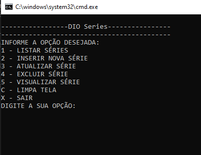
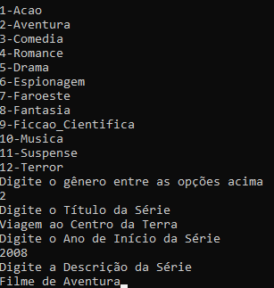
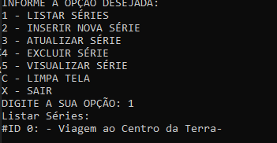
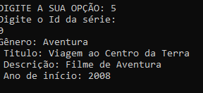
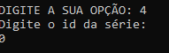

## Sistema de cadastro de Séries com C#

Esse projeto é um projeto desenvolvido pela Digital Innovation One. Trata-se de um CRUD básico de console, onde o usuário pode excluir, editar, inserir e visualizar suas séries. 

### Menu

### Inserir

### Listando Séries

### Listando informações

### Excluindo Série por ID

